# NotchIsland

A free and open source Dynamic Island for the MacBook notch.

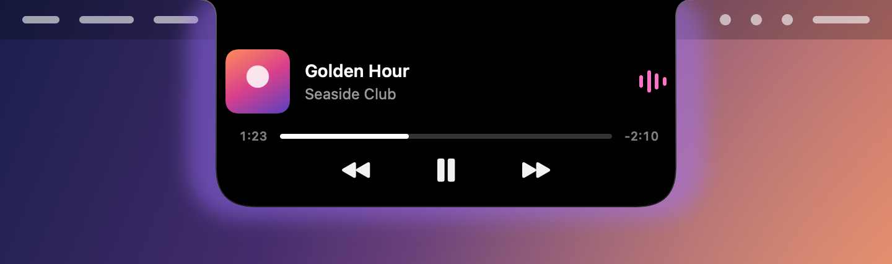

NotchIsland turns the notch into a small live surface. Your music, timers, AirPods, Focus, volume and
the lock screen all show up around the camera housing, with the springy animations of the iPhone's
Dynamic Island. Hover to peek, click to open, and it tucks back into the notch when you're done.

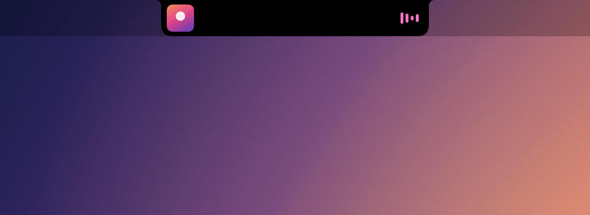

## Features

### Music

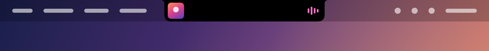

- Works with Spotify, Apple Music, and YouTube in Chrome or Safari.
- The album art sits on one side of the notch and animated audio bars, tinted from the artwork, on the other.
- Click to open: art, title, artist, a progress bar you can drag, and previous, play or pause, and next.
- Click the art to jump to the player, or to the browser tab playing the video.

### Timers and stopwatch

| A timer, with music playing | The stopwatch |
| --- | --- |
| 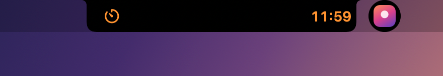 |  |

- Shows the timers you start in the Clock app, with Siri or from Control Center, the way the Dynamic Island does.
- Open the island for the time shown large, with pause and cancel.
- When a timer ends, the island shows it finished until you stop it. Clock does the ringing.
- Clock's stopwatch shows the same way, in whole seconds.
- If music is playing, it moves to a small bubble beside the island, like two activities on an iPhone.

| Open | Finished |
| --- | --- |
| 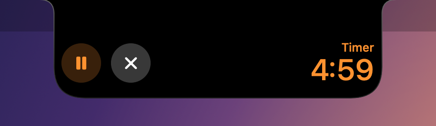 | 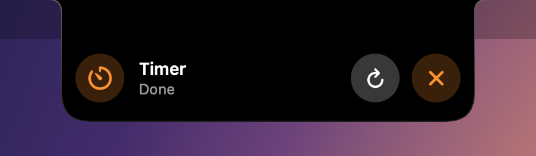 |

### AirPods

| When they connect | When they go in your ears |
| --- | --- |
| 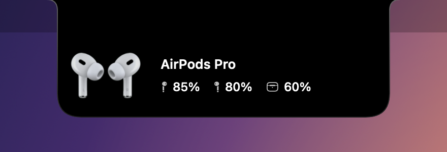 | 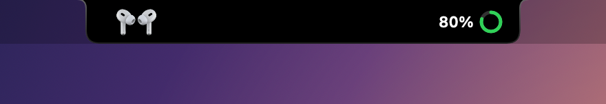 |

- When your AirPods connect, a card shows the same turning 3D animation macOS uses, with the battery of
  each bud and the case.
- The moment they go in your ears, the card shrinks into a compact pill with a battery ring.
- Other Bluetooth headphones get a simpler version.

### Focus

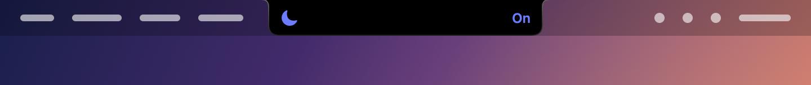

- A Focus turning on or off shows its own symbol and color, with On or Off beside it.
- It reads your actual Focus modes, including custom ones, so their icons and colors match what you set.

### Volume and brightness

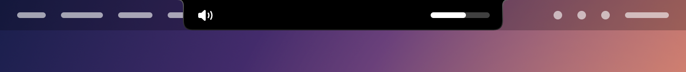

- Replaces the macOS volume and brightness indicator with a level bar beside the notch.
- Option and Shift together still give fine steps.

### Lock screen

| Center, Then Side | Side Only |
| --- | --- |
|  |  |

- When you lock your Mac, a lock appears below the notch and moves to the side. When you unlock, the
  shackle springs open before it tucks away.
- It shows on the lock screen itself, not only after you unlock.
- Two styles: Center, Then Side (the default), or Side Only, which never visits the middle.

### Battery

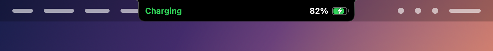

- Charger plugged in or out, and low battery at 20% and 10%.

### Glass

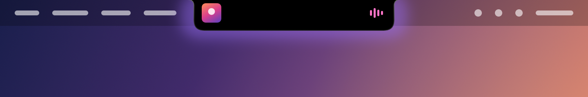

- A soft frosted glass appears behind the island when you hover, when it opens, when an alert shows up,
  and for a moment when your music starts, pauses or changes track.
- Pick Frosted Glass, Liquid Glass or a plain blur, give it any color, and set its strength.

### The small things

- A light haptic tick when you hover the notch.
- Sounds taken from macOS: the lock and unlock clicks, a chime when AirPods connect, and a low battery alert.
- The music and timer activities step aside when an app is full screen.
- Adjustable notch size, so the island lines up exactly with your camera housing.

## What makes it different

- **Free and open source.** Anyone can read the code, learn from it, and improve it.
- **It uses what's already on your Mac.** The timers are Clock's own, the Focus modes are yours with
  their own symbols and colors, the AirPods animation is the one macOS itself plays, and the island
  shows on the real lock screen.
- **Almost no CPU when idle.** Nothing polls in the background. The app waits for macOS to announce
  a change and only then does any work. Measured on a MacBook Air M3: 0.00 to 0.02 seconds of CPU time
  per 10 seconds while idle.
- **Glass that shows up when something happens.** It lights up for alerts and media changes, then gets
  out of the way, so nothing blurs in the background while a song plays for hours.
- **Built with care for the details.** The animations never shrink the island past the notch, the
  countdown redraws once a second and only while it's visible, and the side elements are balanced so
  nothing hugs an edge.
- **No Xcode project.** It builds with Swift Package Manager and a Makefile, and `make test` runs its
  checks, all with just the Command Line Tools.

### Compared with other notch apps

The best known notch apps, as their own pages describe them in September 2026. Prices and features
change, so check each one for the latest.

| | NotchIsland | [Alcove](https://tryalcove.com) | [NotchNook](https://lo.cafe/notchnook) | [boring.notch](https://github.com/TheBoredTeam/boring.notch) |
| --- | --- | --- | --- | --- |
| Price | Free | Paid | Paid | Free |
| Source code | Open, GPL-3.0 | Not public | Not public | Open, GPL-3.0 |
| Known for | Clock timers, your own Focus modes, AirPods, the lock screen | Live Activities, notifications, custom HUDs, lock screen widgets | Media controls, calendar, file tray, webcam mirror | Music visualizer, calendar, file shelf with AirDrop, weather |

NotchIsland keeps to the essentials: it has no file shelf, calendar, webcam mirror, weather or
notifications. If you want those, NotchNook and boring.notch are worth a look.

## Requirements

- A MacBook with a notch.
- macOS 15 or later. Developed and tested on macOS 27.
- The Xcode Command Line Tools (run `xcode-select --install` if you don't have them). The Liquid Glass
  style needs macOS 26 and version 26 of the tools; without them, the blur takes its place.

## Install

```bash
git clone https://github.com/goncaloqpinheiro/NotchIsland.git
cd NotchIsland
make run
```

That builds the app into `build/NotchIsland.app` and opens it. It has no Dock icon; you'll find it in
the menu bar. Right-click the notch or use the menu bar icon to open Settings.

To start it with your Mac, add `build/NotchIsland.app` in System Settings > General > Login Items & Extensions.

## Permissions

macOS asks for each one the first time it's needed, and every feature that needs one is optional.

- **Automation** for Spotify, Music, Chrome and Safari: to read what's playing and control playback.
- **Bluetooth**: to notice AirPods connecting and read their battery.
- **Accessibility**: to show volume and brightness in the notch.
- **Full Disk Access** (optional): only for Focus, because macOS keeps the Focus state in a protected
  folder. NotchIsland reads just the two Focus files.

The timer and stopwatch buttons can control Clock through a few one-action shortcuts that you create
once in the Shortcuts app. Settings > Clock lists them. Without them, everything still shows and the
buttons open Clock.

## Privacy

No accounts, no analytics, no tracking. The app only goes online to fetch Spotify's album art, and the
thumbnail and title of the YouTube video you're watching.

## Good to know

- NotchIsland uses some private macOS frameworks: SkyLight for the lock screen, DisplayServices for
  brightness, MediaRemote for media commands, and private IOBluetooth properties for AirPods battery. A
  macOS update could break any of them, and they keep the app off the Mac App Store.
- The AirPods animations and sounds are loaded from macOS while the app runs. None of Apple's files are
  included in this repository.
- Opening the AirPods case can't be detected on macOS 27. The card appears when they connect.
- YouTube shows no progress bar, because the timeline isn't readable from outside the page.

Curious how it all works? [docs/how-it-works.md](docs/how-it-works.md) covers the internals, the
project layout, and the development commands.

## Built with Claude Code

NotchIsland was built with [Claude Code](https://www.claude.com/product/claude-code), Anthropic's AI
coding tool, through a long back and forth: every feature was described, built, tried on a real
MacBook, and refined from feedback until it felt right.

## Contributing

Issues and pull requests are welcome. Please keep changes event driven (no polling), run `make test`,
and try them on a real notched Mac.

## Author

Made by Gonçalo Pinheiro. Say hi on [LinkedIn](https://www.linkedin.com/in/gon%C3%A7alo-pinheiro-688375336/) or
[GitHub](https://github.com/goncaloqpinheiro).

## License

NotchIsland is free software, released under the [GNU General Public License v3.0](LICENSE). You can
use, study, share and change it. If you share a changed version, it has to stay open source under the
same license.

Copyright (C) 2026 Gonçalo Martins Ribeiro Queiroz Pinheiro

## Credits

Inspired by the iPhone's Dynamic Island and by Alcove. The lock screen window technique comes from
[SkyLightWindow](https://github.com/Lakr233/SkyLightWindow) by Lakr233.

NotchIsland is an independent project and isn't affiliated with or endorsed by Apple. Apple, AirPods,
Dynamic Island, Mac, MacBook and macOS are trademarks of Apple Inc. Spotify and YouTube are trademarks
of their respective owners.
